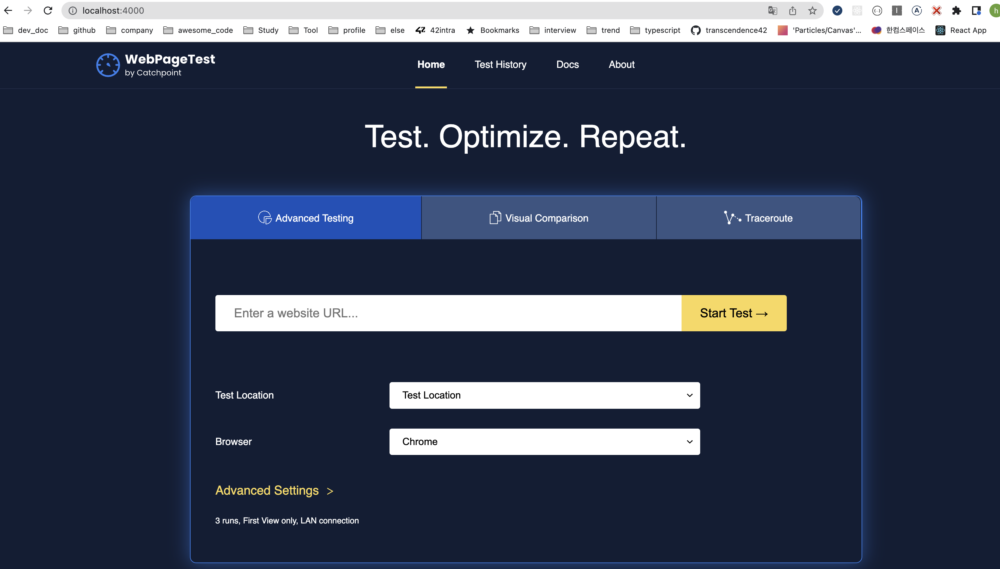
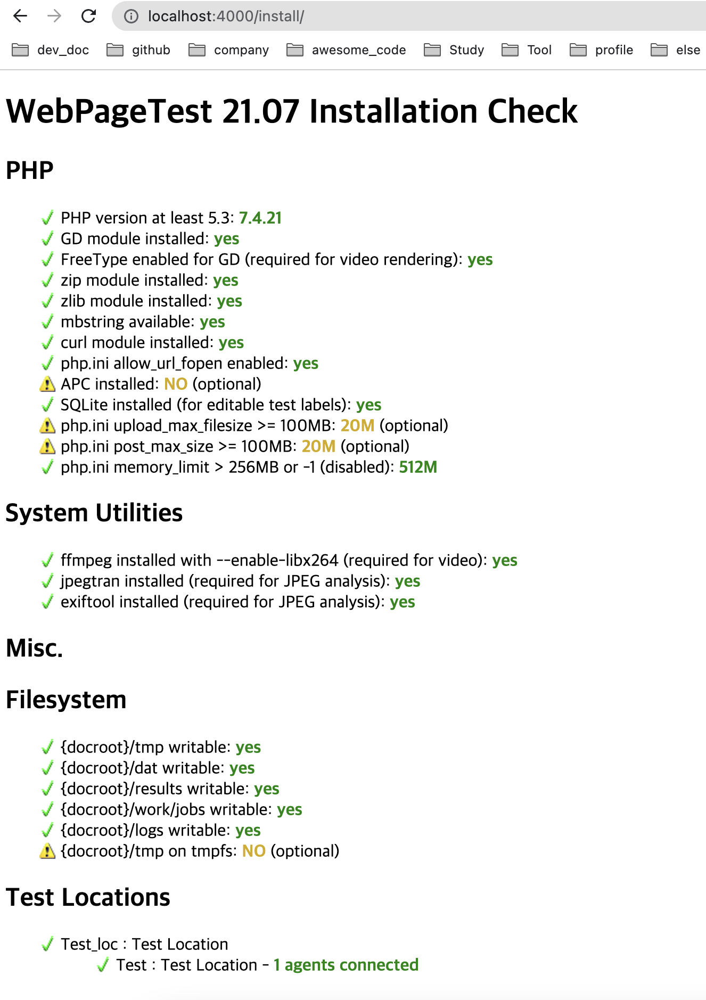

# how to run

### when first installation

```sh
sh setup.sh
```

### run container

```sh
sh run.sh
```

### cleanup container and images

```sh
sh cleanup.sh
```

## urls

### main page

<details>
<summary>http://localhost:4000/</summary>
    


</details>

### install page

<details>
<summary>http://localhost:4000/install/</summary>



</details>

## tips

```
docker image ls
docker ps
docker stop 6645e33de5c4
```

## Errors

> WARNING: Published ports are discarded when using host network mode

## 참고

- https://docs.webpagetest.org/private-instances/
- https://hub.docker.com/r/webpagetest/server/
- https://hub.docker.com/r/webpagetest/agent/
